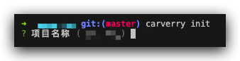

## carverry

这是一个比较激进的可视化搭建~~方案~~玩具，适用于`vue3.2+/TS/vite`技术栈的项目；目的在于利用可视化**快速搭建页面**，注入**逻辑变量**，然后自动生成拼接好的胶水代码；目前主要由三个包组成：

- `@carverry/app`：[](https://github.com/xxf1996/carverry/blob/master/packages/app/README.md)
- `@carverry/core`：[](https://github.com/xxf1996/carverry/blob/master/packages/core/README.md)
- `@carverry/helper`：[](https://github.com/xxf1996/carverry/blob/master/packages/helper/README.md)


## 快速开始

1. 首先全局安装 `ts-node`、`@carverry/app`、`@carverry/core`；

```bash
npm i -g ts-node @carverry/app @carverry/core #or
yarn global add ts-node @carverry/app @carverry/core #or
pnpm add -g ts-node @carverry/app @carverry/core
```

​	如果安装完了这些包，想要快点进行玩耍的话，可以直接`clone`[示例项目](https://github.com/xxf1996/carverry-demo-project)进行使用；

2. 然后在项目命令行进行初始化：

```bash
carverry init
```

按照交互式命令进行对应选项的配置：



> 如果想全部使用默认配置，可以使用`-y`选项来完成：
>
> ```bash
> carverry init -y
> ```

3. 接着在项目中使用`@carverry/helper`来注册可视化预览相关的路由：

```bash
yarn add -D @carverry/helper
```

安装完`@carverry/helper`后，需要在项目启动配置文件里对`router`实例使用一个**辅助函数**：

```ts
import { addCarverryRoute } from '@carverry/helper';
// ...

if (import.meta.env.MODE === 'development') { // 仅需要在开发环境引入
  addCarverryRoute(router, () => {
    // ... 这里是注册完可视化预览路由成功后的钩子，可以在这里做一些自定义逻辑，主要是涉及到路由数据相关的
  });
}
```

4. 完成配置后，就可以启动可视化搭建应用了：

```bash
carverry start #or
carverry #可以直接省掉start命令，因为默认命令就是start
```


## 相关文档

- [操作文档](https://github.com/xxf1996/carverry/blob/master/docs/basic.md)：关于可视化搭建应用的各种操作和基本概念
- 物料开发文档：TODO
- 开发文档：TODO


## 物料包

- [`@carverry/demo-material`](https://github.com/xxf1996/carverry-material) ：做示范的物料包
