## 基本操作

### Block

`Block`是单个可视化操作区域，其本质上对应一个配置文件，即组件树；因此可以把一个`Block`完全**等价于一个`Vue`组件**，只不过组件功能有大有小，所以`Block`代表的功能实际上取决于使用者的目的，可以把`Block`当做**页面**来管理，也可以只是一个**局部区域**（模块）；

#### 创建Block

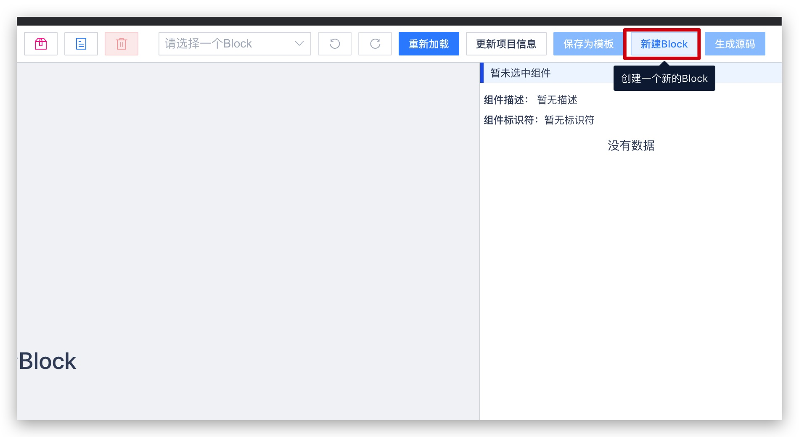

在顶部找到【新建Block】按钮，填写表单即可创建一个新的`Block`；

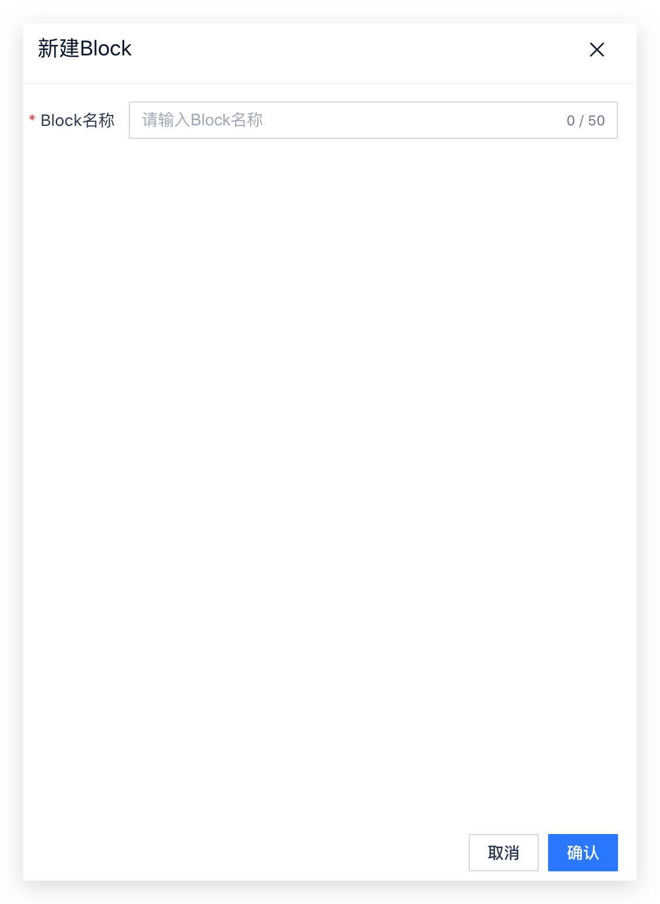

#### 切换/选择Block

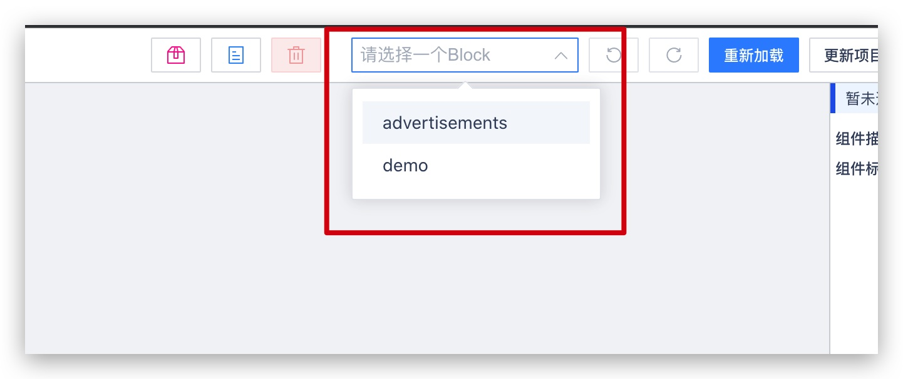

#### 删除Block

**目前**没有提供该功能，暂时可以自己手动从`Block`保存目录进行删除；


#### 生成源码

目前对于修改配置后并不会同步地生成配置对应的源码文件，所以当觉得需要使用当前配置对应源码文件时，可以点击【生成源码】按钮进行生成；

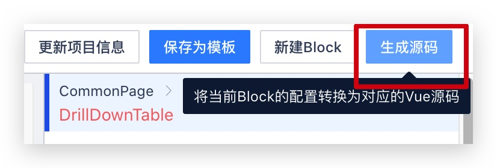

##### 使用源码文件

对于生成的源码文件，其入口为`block源码目录/block-name`，比如生成了一个名为`test`的`block`源码后，可以如下使用该源码组件：

```vue
<script lang="ts" setup>
import Test from 'block源码目录/test';
</script>
```

**注**：默认的`block`源码目录为`src/blocks`（如果项目源码目录为`src`的话）；

##### 为啥要生成源码？

按理说可以借助`rollup`的虚拟文件功能和自定义文件后缀来实现直接对配置文件进行挂载，然后返回该配置文件的源码即可，无非再顾虑像传统的代码开发一样有对应的胶水代码；之所以这么做的理由有：

- 有源码文件可以进退自如，<font color=#f00>免得用到一半发现没法跳车了</font>；
- 还没有测试过虚拟文件挂载的性能和`HMR`；


### 模板

模板功能的初衷是**快速复用某个局部的配置**，如果当你发现一些特定组合的组件形成的区域可以复用，那么就可以快速保存为模板进行复用；实际上当你注意这一点的时候，最好的做法是将其**沉淀为一个新的组件**；不过最终还是保留模板功能的意图就在于可以对局部配置的快速**复制粘贴**使用。

#### 保存为模板

1. 首先选择想要保存的组件节点：

   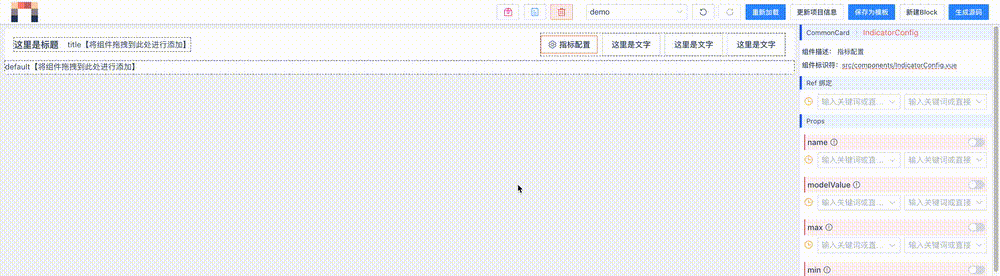

2. 然后点击**【保存模板】**，填写表单即可完成保存；


### 可视化交互

#### 从物料库选中组件进行插入

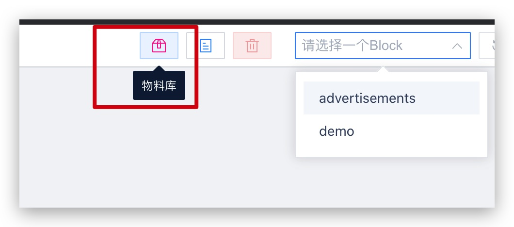

点击即可打开物料库面板，物料库由两个部分组成：

- **本地组件**：直接从源码目录获取项目中的`Vue`文件；
- **物料包**：以包的形式发布的公共组件；

##### 本地组件

本地组件通过**目录树**的形式进行匹配，以源码目录为根目录，而`src/some/path/*`就代表这一级目录下的所有`Vue`文件，如：


##### 物料包

物料库面板中，除了本地组件的部分其他都是物料包的内容，每个`tab`对应一个物料包；通常来说，一个物料包默认都没有被安装，所以可以先点击**【安装物料包】**按钮进行安装：

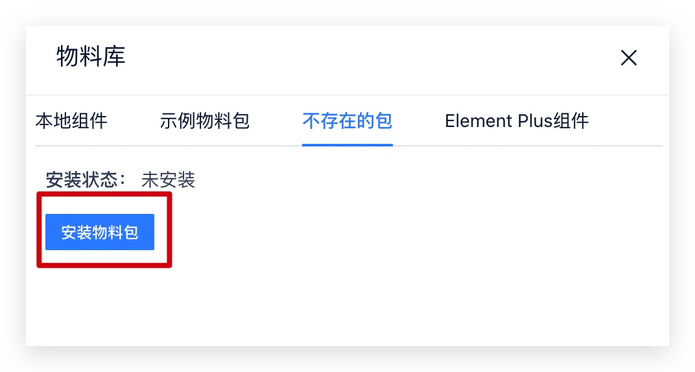

安装完成后，就可以看到对应物料包的组件列表；通常一个物料包有**不同的分类**：

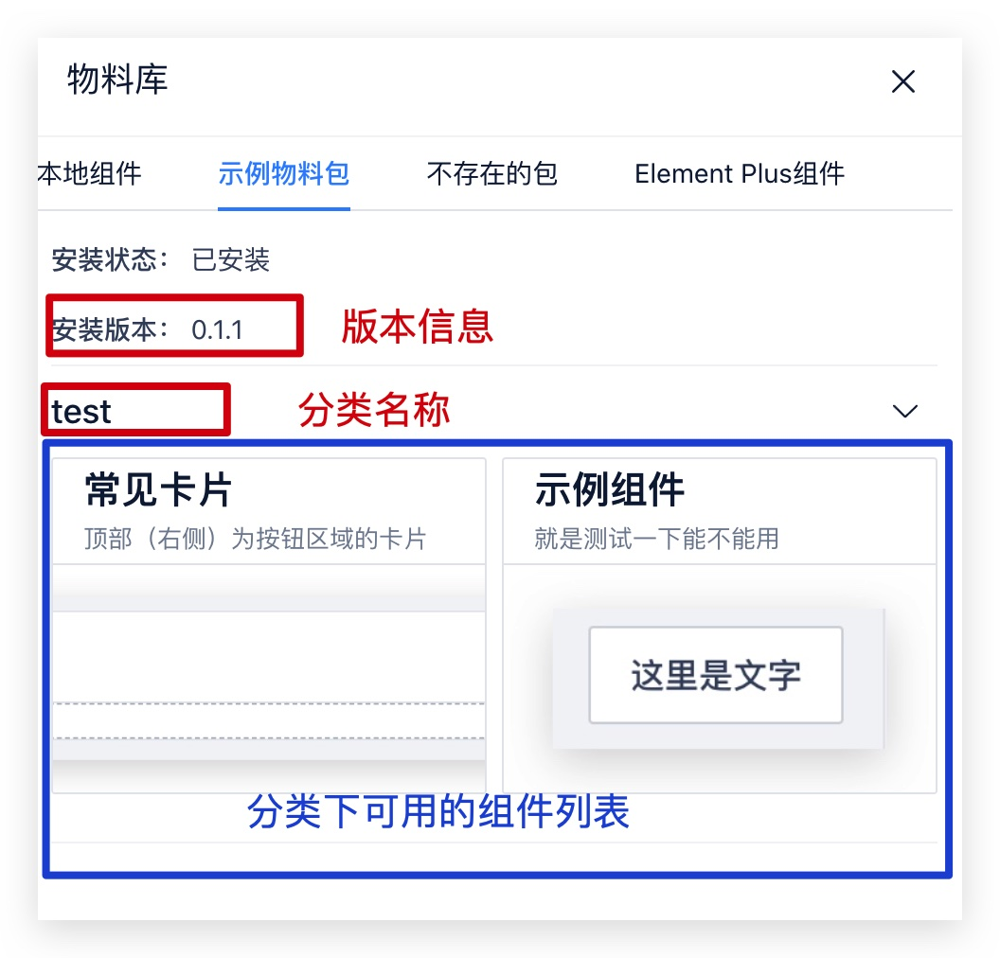

##### 插入操作

不管是本地组件还是物料包的组件，其插入操作都是一样的；直接拖拽组件卡片到页面中对应的位置即可：

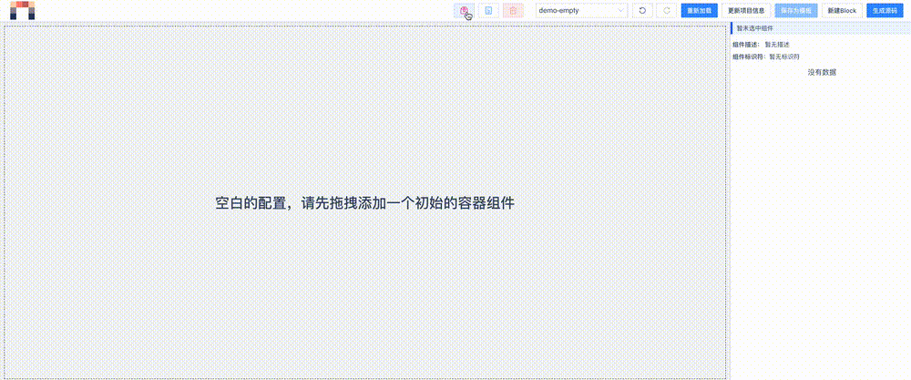

需要注意的是插入实际上有两种情况：

- **插入空白容器**：即当前容器是没有子组件的，情况就跟上面一样；

- **插入非空容器**：即当前容器已存在子组件，那么插入时就需要注意插入的顺序，这种情况可以注意出现的插入位置的引导条，插入时会**直接插入到引导条的位置**：

  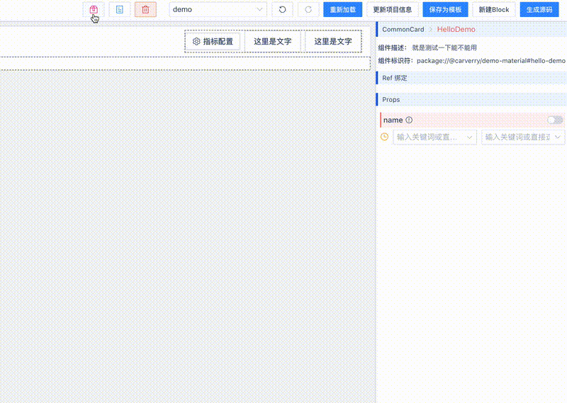

#### 从本地模板选中模板进行插入

首先打开本地模板：

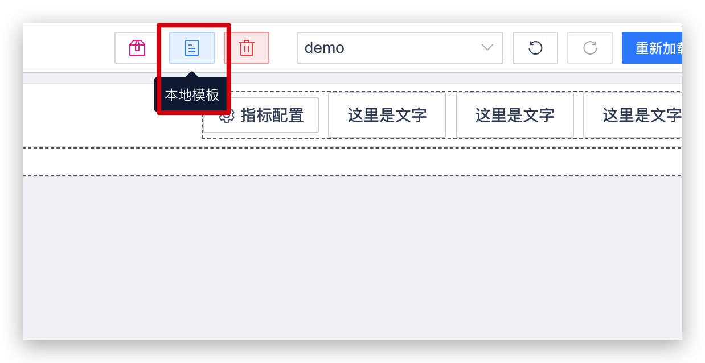

然后从列表里面选中对应的模板卡片插入即可，插入操作同物料库一致：

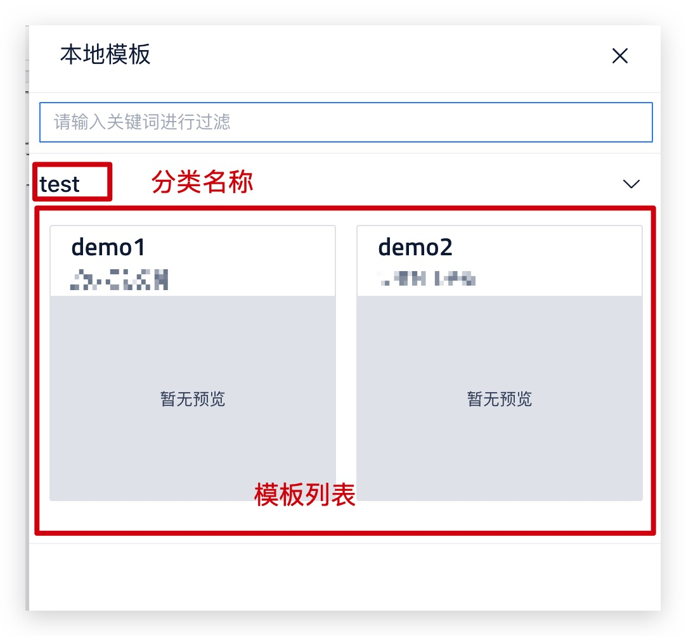

#### 选中物料组件

当要选中某个特定的物料组件时，直接用鼠标`hover`选中即可，鼠标在`hover`预览区域时会自动高亮显示**当前鼠标位置命中的一个配置节点**：

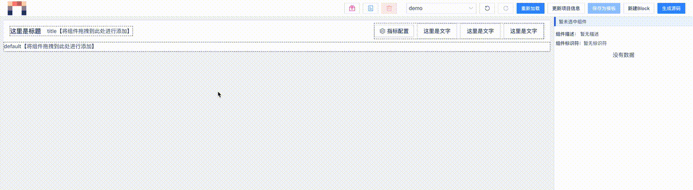


#### 容器内排序操作

当一个组件容器内插入了多个子组件时，想要对其中的子组件进行顺序调换时，只需要拖拽相应组件即可交换顺序：

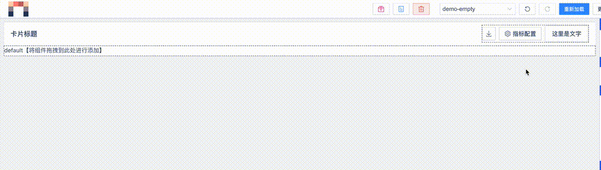


### 节点配置

当选中一个物料组件时，可以对相应的节点进行相关的配置；

#### 移除操作

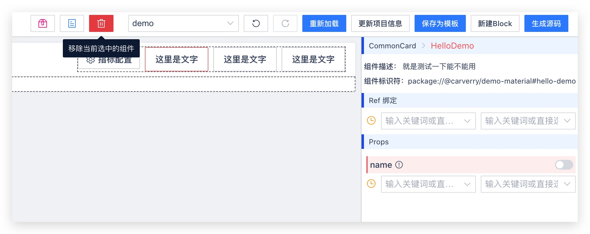

#### redo/undo操作

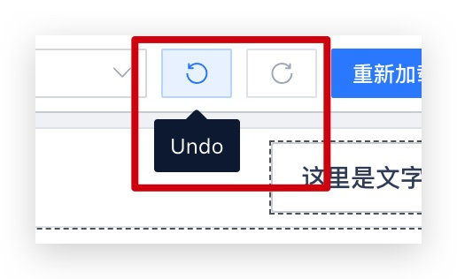

对节点配置的**每次改动**都会被记录到历史记录里，但是最多只会记录**10条**最近的记录；该功能主要用于发生意外操作时可以紧急回退，作为保底。

#### Ref/Props/Events

这三个类型的操作很类似，都是选取变量进行绑定；选取变量主要分为文件和变量两个部分，

- **文件**：这里将源码目录中所有的`TS`文件按照**目录树**的结构进行匹配；

  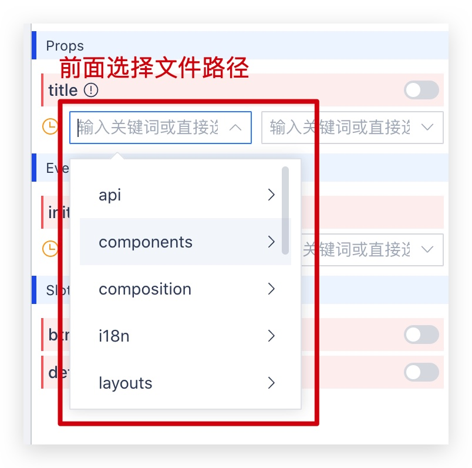

- **变量**：当选中一个文件后，会列出里面所有`export`的变量；

  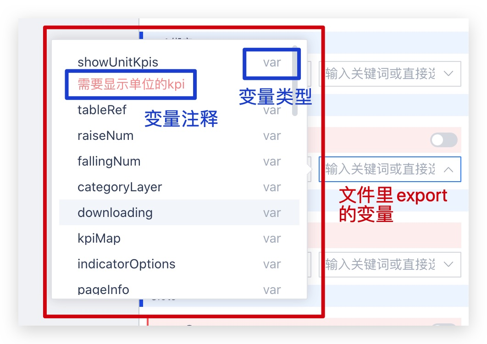

  > 注：目前对于变量类型的推断很粗糙，只有`var`和`function`两种类型；

当然，如果需要配置的变量过多，那么频繁选择文件路径就很繁琐，因此可以使用最近使用过的文件路径快速选择：

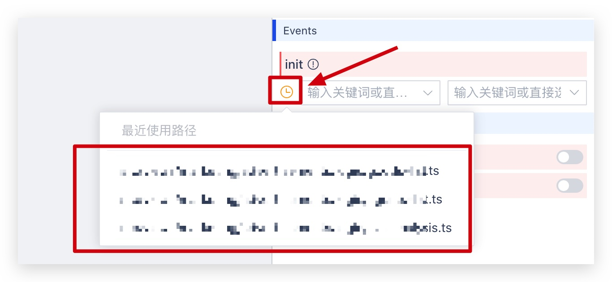

不过对于`Props`的设置还有一个特殊的地方，那就是是否对变量按照`v-model`方式进行绑定：

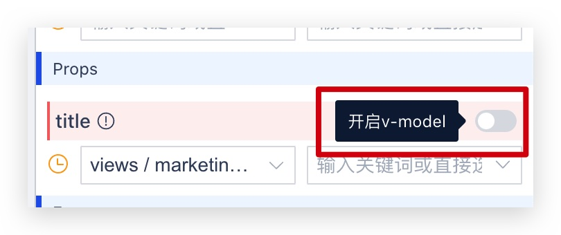

#### Slots

原本对于`Slots`本身是没有什么额外需要配置的，因为`Slots`本身都转化为组件容器了（因此主要交互都在可视化交互那里）；但是由于**预览源码输出机制**的影响（正常的源码输出不受影响），某些`slot`的默认内容会被覆盖而受影响，因而只好额外加个配置手动解决；

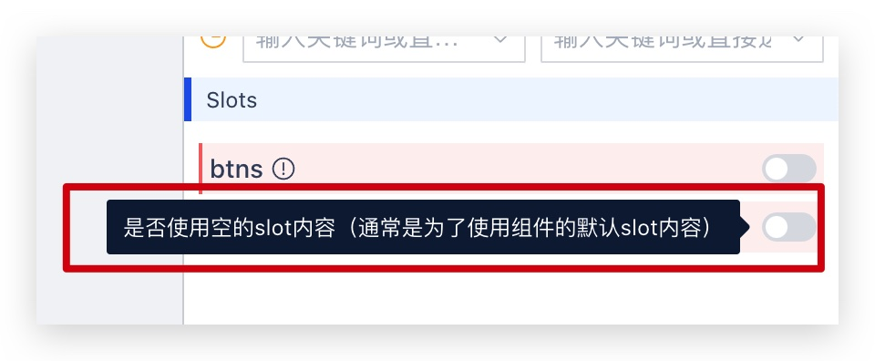

### 辅助功能

#### 跳回到源码文件

当选中的组件是本地组件时，可以支持直接跳转到`VScode`编辑器中并打开源码文件：

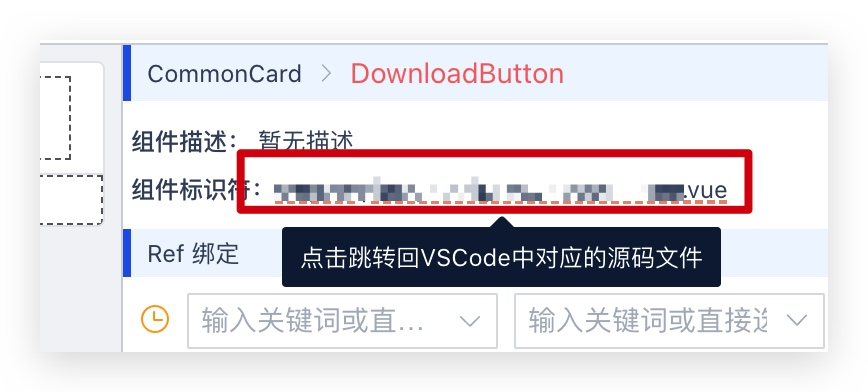

#### 重载预览

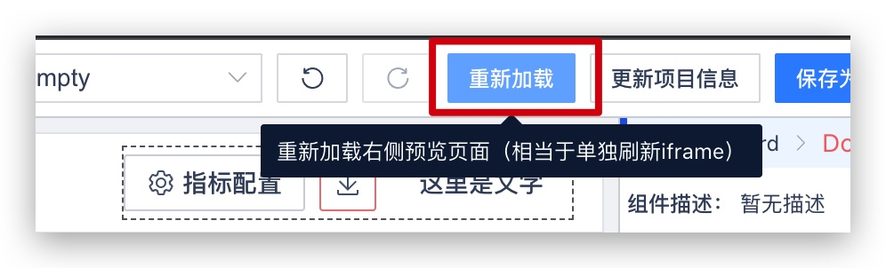

#### 手动更新项目信息

由于**目前**还没对本地项目文件开启监听热更新，因此改动本地组件和逻辑文件后可视化应用的信息不是最新的，此时可以手动更新解决一下：

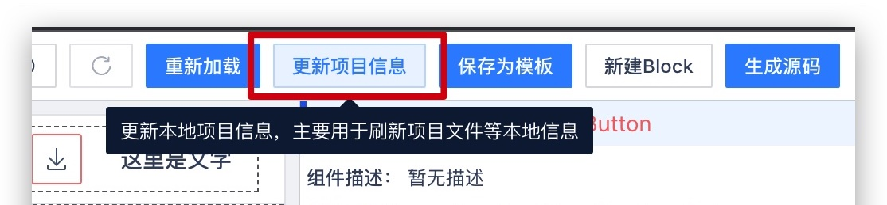